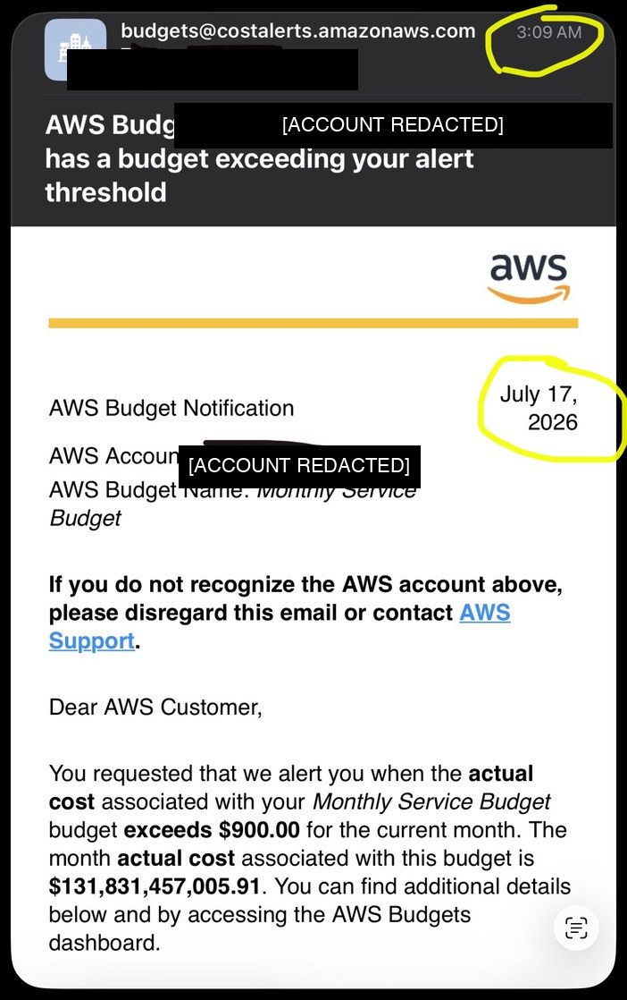

# kronos

> A claim-centric assurance control plane that continuously reconciles system claims against observed reality and executes bounded, authorized challenges to determine which claims survive — under what conditions, with what coverage, confidence, and freshness.

**Status:** design frozen at v0.5 (see [`docs/CONVERGENCE-DECLARATION.md`](docs/CONVERGENCE-DECLARATION.md)). Runner, oauth-server, actions, and templates all pending scaffold — the next artifact is an actual implementation prototype, not another review round.

**Kronos does not certify that software is safe. It makes assurance claims testable, challengeable, and auditable.**

---

  

<em>2026-07-17, 3:09 AM. The moment Kronos was named.</em>

The full story of why this bill was never real, why an empty AWS account cannot generate 120 petabytes of NAT-gateway traffic per day, and why that impossibility is the load-bearing insight of Kronos: [`docs/inception/00-founding-incident.md`](docs/inception/00-founding-incident.md).

## What kronos is

**kronos** is a discipline for producing reproducible, time-bounded evidence about whether declared system claims survive authorized challenge and continuous reconciliation. It works on any target system, in any language, on any runtime, at any deployment surface.

Kronos operates two peer runtime planes:

- The **continuous assurance plane** runs passive and low-impact evaluations on schedule or event trigger — cost/inventory reconciliation, resource-count-vs-quota, control drift, evidence freshness, alert-channel and kill-switch health. This is the plane that would have caught the founding incident within hours.
- The **engagement plane** runs explicitly authorized on-demand interventions — diagnostic control challenges, adversarial simulations, fault injections, load tests, tabletop exercises.

The framework's primary consumer-facing artifact is the **kronos scorecard**, which renders a target's assurance posture across twelve dimensions with multidimensional per-cell state (maturity + effectiveness + coverage + confidence + freshness + fidelity + open findings + catalog gap). The scorecard is deliberately not a single-number safety certification; it reports what has been evaluated, what has survived, and what remains untested, at which catalog version, in which environment, with what evidence age.

The discipline is intentionally folder-and-file-based. It works with `git` on any host, doesn't require a database or runtime service to persist findings, and can be adopted by any team without adopting any framework's stack choices. Typed schemas for the domain-model objects are the source of truth; markdown is a human projection of the typed schemas.

## Why kronos is not only a security tool

Kronos treats **security, cost, availability, data integrity, operational discipline, response readiness, and compliance drift** as peer classes of vulnerability. Any of them can end a company; all of them deserve deterministic, reproducible verdicts.

The founding incident linked above was not a security compromise. It was a cloud-provider billing pipeline defect that surfaced a phantom $131,831,457,005.91 charge on the operator's launch day. No security tool would have caught it; a **plausibility monitor** comparing observed cost against declared infrastructure capacity would have caught it within hours. Kronos treats this class of vulnerability as a first-class concern with its own runtime primitive (see [`methodology/PLAUSIBILITY-MONITOR.md`](methodology/PLAUSIBILITY-MONITOR.md)).

## The dialectic with eos

Kronos and [eos](https://github.com/alchemisthomer/eos) are complementary methodologies. Eos attests — it produces evidence that a system does what its designers claim it does. Kronos falsifies — it produces evidence that a system's claims can (or cannot) be broken under adversarial pressure. Neither framework is complete alone.

Both frameworks operate independently. When co-installed in the same target, they integrate bidirectionally through git-native structural hooks: a kronos finding that falsifies an eos-attested claim auto-files a new backlog cycle in the eos kanban; the kronos scorecard can read the eos cycle folder for traceability. Per ADR-0008, however, kronos scorecard L3 is attainable natively without external attestation — eos coupling is a value-add for traceability, not a gate.

## What this repository contains

| Path | Contents |
|---|---|
| [`methodology/`](methodology/) | Fourteen documents specifying the framework's runtime primitives: operating manual, scorecard model, engagement template, tool binding, plausibility monitor, continuous assurance plane, canonical typed domain model, evidence handling, oracle state machine, catalog governance, autonomous authorization, industry-standards alignment, and inventive-concept candidates |
| [`runner/`](runner/) | (Pending scaffold) A React/TypeScript reference viewer that reads any GitHub repository's `kronos/engagement/**` folder tree via the GitHub REST API and renders the kanban plus the scorecard in the browser |
| [`oauth-server/`](oauth-server/) | (Pending scaffold) A small standalone Node/Express service that completes the GitHub App user-to-server OAuth code-for-token exchange on behalf of the browser viewer |
| [`actions/`](actions/) | (Pending scaffold) Reusable GitHub Actions enforcing kronos discipline on target repositories |
| [`templates/`](templates/) | Copy-in scaffolds for adopting projects: the eight-stage engagement kanban tree, the engagement document template, the target scorecard configuration |
| [`docs/`](docs/) | Twenty architecture decision records, worked-example reference implementations, the founding incident case study, the GTM sanity-check strategy document, and the v0.5 convergence declaration |
| [`DESIGN.md`](DESIGN.md) | The wide-net vision document. Read this after this README for the full architectural picture. |

## Installation

Adoption is by filesystem copy today (matching eos's pattern). See [`docs/HOW-AN-ADOPTER-STARTS.md`](docs/HOW-AN-ADOPTER-STARTS.md) for the one-page adoption flow.

An `npx kronos init` scaffolder is planned for a later revision. The filesystem-copy default is deliberate — the methodology is portable across every stack, so the primary adoption path shouldn't couple adopters to any one runtime (Node, Python, Go, or otherwise).

## Ethics gate

Kronos operates only under authorized adversarial assessment when operated by CloudPremise LLC and its explicit customers. The framework itself is dual-use, in the same sense as Metasploit, Burp Suite, sqlmap, and Nmap: any tool capable of testing the defenses of a system on behalf of that system's owner is equally capable of attacking that system on behalf of an adversary. This is a permanent property of adversarial-testing frameworks; it cannot be engineered away.

Kronos addresses this property structurally rather than pretending it does not exist:

- The framework requires a signed authorization artifact for every active engagement. See [`methodology/AUTONOMOUS-AUTHORIZATION.md`](methodology/AUTONOMOUS-AUTHORIZATION.md) for the two-tier envelope model that handles both human-signed and machine-issued authorizations.
- CloudPremise LLC operates only under signed authorization. Unauthorized use by any party is the responsibility of that party.
- The framework does not include, and will not include, any capability whose only rational purpose is malicious use with no authorized-defensive counterpart.

See [`methodology/INVENTIVE-CONCEPT-CANDIDATES.md`](methodology/INVENTIVE-CONCEPT-CANDIDATES.md) §7 for the full dual-use discipline.

## Inventive concept candidates

The kronos methodology has a number of candidate differentiators and potential inventive concepts. **Novelty, non-obviousness, claim scope, and freedom-to-operate have not been established** — the framework acknowledges significant adjacent prior art (NIST SP 800-115, MITRE CALDERA, Atomic Red Team, breach-and-attack-simulation platforms including AttackIQ / SafeBreach / Cymulate / Pentera / Horizon3, cloud-security-posture platforms including Wiz / Prisma / Orca, ATT&CK-based scoring research, NIST OSCAL, SLSA supply-chain provenance).

The strongest candidates for eventual patent claims are specific technical mechanisms — enumeration reconciliation as mandatory tool-binding contract, execution-provenance signing binding evidence to specific tool invocation via SLSA-aligned attestation, git-history scorecard recomputation producing time-series trajectory from source-of-truth without separate persistence, capacity-model bounds derivation for physical-plausibility monitoring, and dual-plane execution model with challenge-as-parent-abstraction. Methodology-level framing faces steeper Alice/§101 subject-matter-eligibility headwinds in the US and is more defensibly held as open-source-moat differentiation.

See [`methodology/INVENTIVE-CONCEPT-CANDIDATES.md`](methodology/INVENTIVE-CONCEPT-CANDIDATES.md) for the conceptual-level description with explicit prior-art acknowledgment.

## IP posture (deferred hybrid — see `methodology/INVENTIVE-CONCEPT-CANDIDATES.md`)

Kronos is licensed under GNU AGPL v3 today, published in public, and its findings are opt-in-disclosable per finding. The strategic question of whether specific technical mechanisms warrant patent protection is **deferred pending IP counsel review**. The operator has elected hybrid framing — the framework is described using both patent-claim and open-source-moat language in parallel; downstream resolution will narrow one direction, both, or neither.

The framework's structural properties (git-native governance, AGPL license, open catalog, community contribution flow) remain in place regardless of the IP resolution. Contributors to the repository accept the AGPL-3.0 patent grant (§11) as part of the contribution agreement.

## License

[GNU Affero General Public License v3.0](LICENSE). Deployments that expose modified versions of this code over a network must offer corresponding source to those network users. The license does not restrict use, does not detect forks, and does not shield operators from liability for unauthorized activity — it is a copyleft license, not an authorization control.

## Reference implementation

The flagship implementation of kronos is against the [olympus-616](https://github.com/olympus-616/olympus-616) platform. Its installed engagement history — every shipped adversarial evaluation, every open engagement, every scorecard state — lives inside that project at `foundation/kronos/engagement/` and is not part of this repository. See [`docs/examples/olympus-616.md`](docs/examples/olympus-616.md) for how kronos is applied there.

## Where kronos sits among adjacent products

Kronos is neither a scanner nor a certification. Adjacent categories and how kronos relates:

- **Vibe-code security scanners** (CheckVibe, Vibe App Scanner, StackHawk Vibe, Aikido, Lovable native security, Replit Security Center) — these ship commodity security checks and remediation aimed at AI-built apps. Kronos overlaps in check surface but differs in producing a claim-oriented release recommendation with evidence and re-test rather than a scanner report.
- **Breach-and-attack simulation** (AttackIQ, SafeBreach, Cymulate) — continuous control validation with vendor-cloud evidence stores. Kronos evidence is git-native + opt-in-disclosable, and kronos treats cost/plausibility as a peer of security which BAS platforms do not.
- **Automated pentesting** (Pentera, Horizon3.ai, XM Cyber) — path-finding from external attacker to crown-jewel data. Kronos is claim-centric ("did this defense fire") rather than exploitation-path-centric ("here is a shell"). Different question, different buyer.
- **Cloud security posture management** (Wiz, Prisma Cloud, Orca) — passive scan against IaC and running resources. CSPM is passive-only; kronos actively challenges. Kronos treats cost integrity as a peer of security which CSPM does not.
- **SAST/DAST + dependency scanning** (Snyk, GitHub Advanced Security, Semgrep) — engineering-facing static and runtime analysis. Kronos consumes their output as one input rather than replacing them.
- **Cloud FinOps** (Harness, Sedai, Kion, Finout, LiteLLM, AI Cost Guard) — statistical anomaly detection and budget enforcement for cloud/LLM spend. Kronos does deductive impossibility ("your declared infra has zero NAT gateways, therefore any NAT charge is physically impossible") which is fundamentally different from anomaly detection ("this spend is unusual vs history").

The go-to-market discussion of these adjacencies lives in [`docs/strategy/gtm-sanity-check-2026-07-24.md`](docs/strategy/gtm-sanity-check-2026-07-24.md).

## Name

The spelling is intentional. Κρόνος (Kronos, the Titan) is not Χρόνος (Chronos, time). Kronos preceded the Olympians and devoured his own children so that only what was truly integral survived the reckoning. That is kronos's relationship to the systems it evaluates: it attacks them so what ships is worthy.
